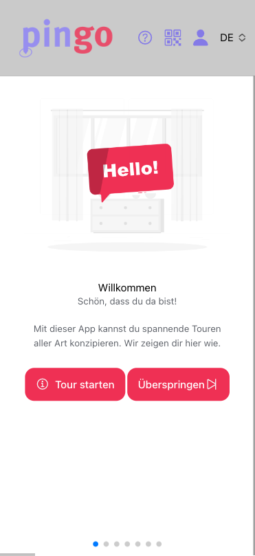
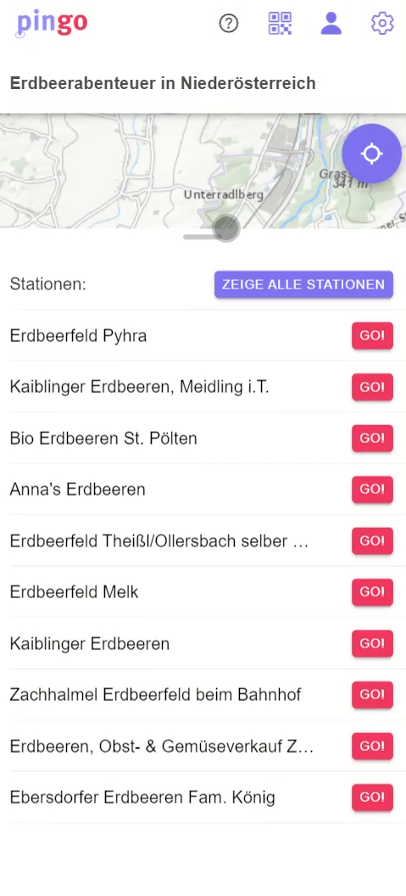
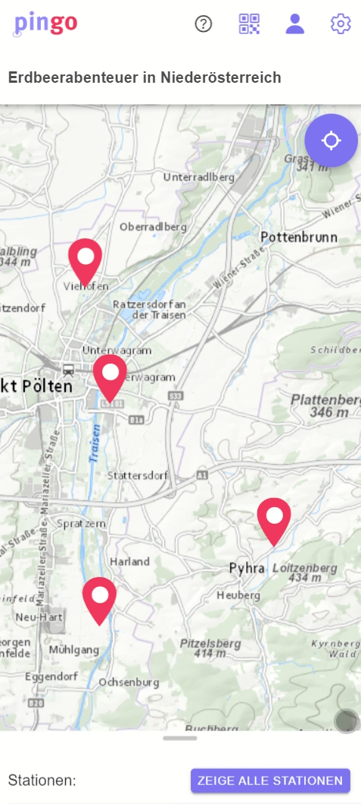
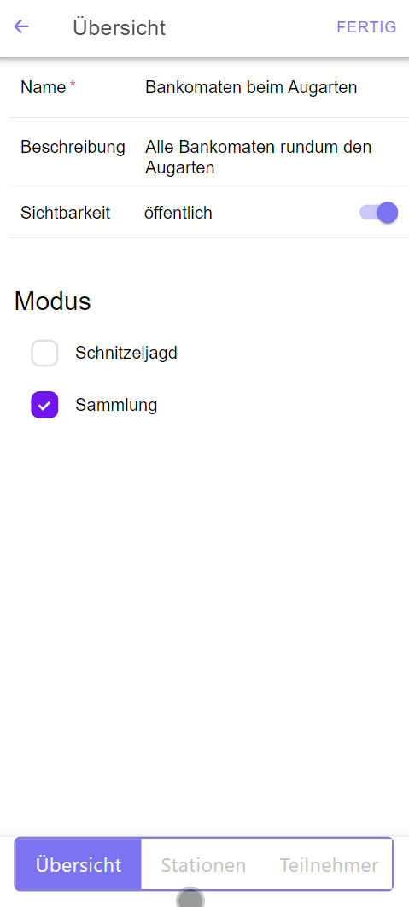
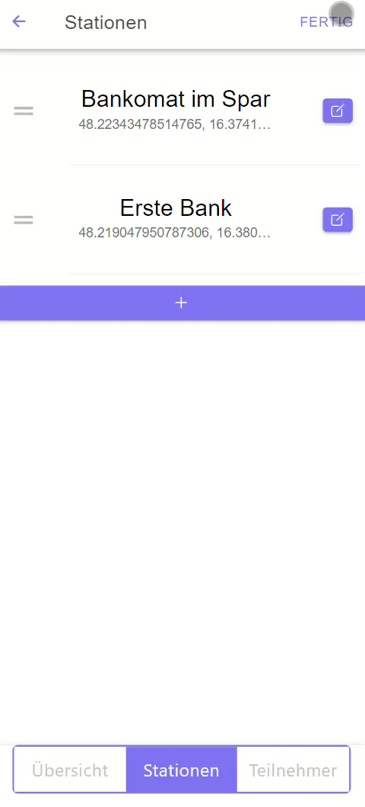
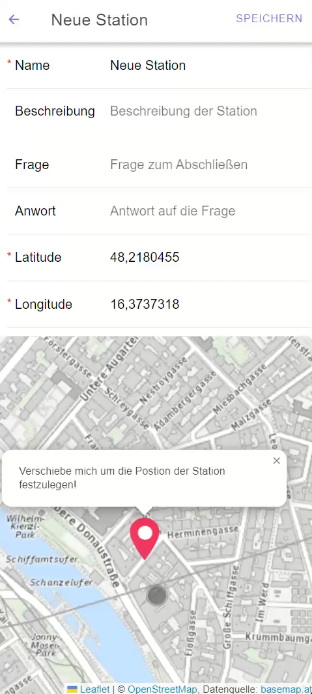
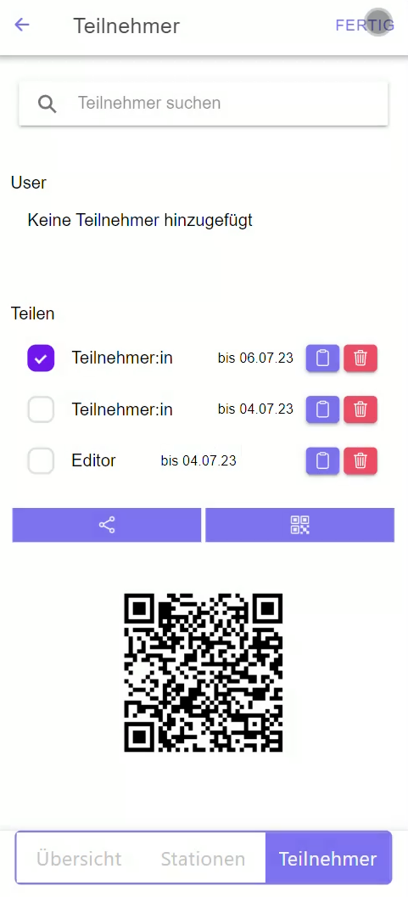

<p align="center">
  <a href="https://ionicframework.com/" target="blank"></a>
</p>

# pinGo

## Description
Create and customize Location Based Services (LBS)

## Tech Stack

| Technologie                                          | Version | Description                        |
|------------------------------------------------------|---------|------------------------------------|
| [Ionic](https://ionicframework.com/docs/components)  | 7       | Mobile Framework                   |
| [Angular](https://angular.io/guide/component-overview) | 16      | Frontend Web Development Framework |
| [Yarn](https://yarnpkg.com/)                         | 1.22    | Package manager                    |
| [Capacitor](https://capacitorjs.com/)                | 4.1.1   | Cross Device support               |


## Run

Go to root directory and execute: 
```
# Go to root directory 
cd /my-project/

# Install dependencies
yarn

# Build the application and start a webserver
ionic serve
```

## Screenshots









## Publish to Android
We will use [Android Studio](https://developer.android.com/studio) as build tool. That installs all necessary SDKs to your machine. 

1. ```ionic config set -g npmClient yarn``` (optional | Switching ionic package manager to yarn)
2. ```ionic capacitor add android``` (creates /android and builds /www directories)
3. ```ionic capacitor copy android``` (copies /www/ source into /android)
4. ```ionic capacitor open android``` (open in android studio)
5. ```ionic capacitor run android``` (you have to [add a virtual or real device](https://developer.android.com/studio/run/managing-avds) first in android studio)

## License
[MIT licensed](LICENSE)
